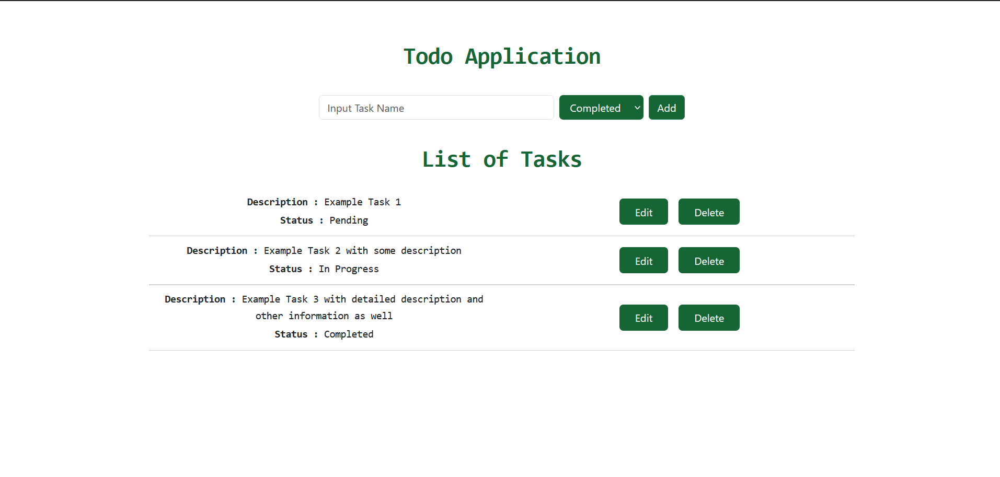
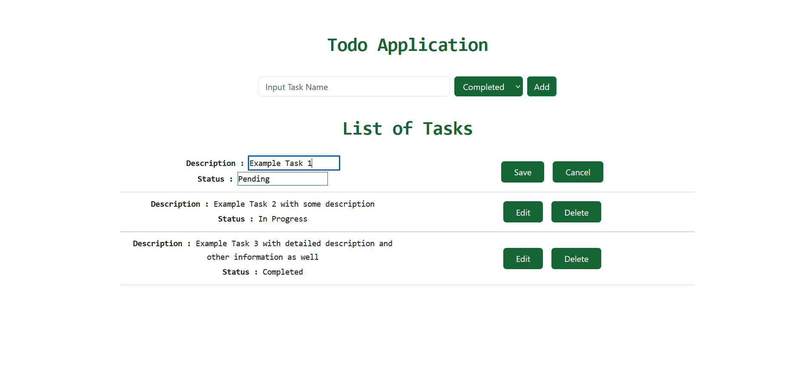
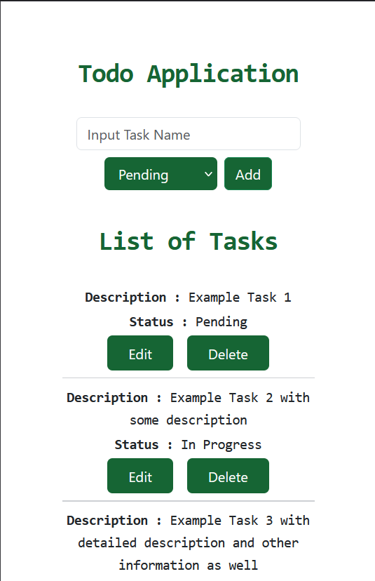
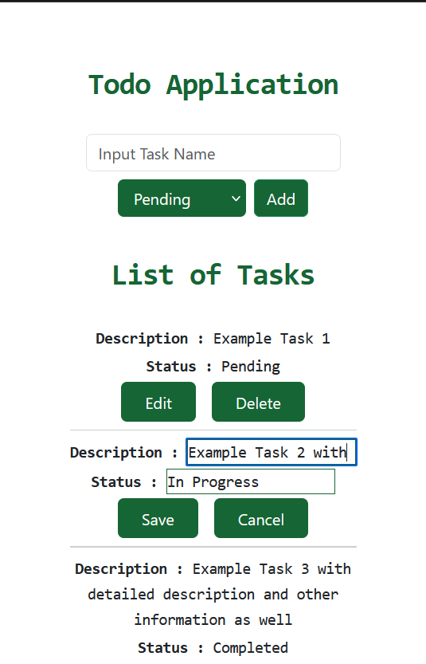

# ToDo Application

A simple ToDo application that allows users to create, update, delete the tasks. Tech Stack used: React, Express, Node, PostgreSQL.

## Table of Contents

- [Features](#features)
- [Screenshots](#screenshots)
- [Installation](#installation)
- [Usage](#usage)
- [API Endpoints](#api-endpoints)

---

## Features

- Create new tasks and set their initial status
- Update task descriptions and status
- Delete tasks
- View all tasks
- Responsive and user-friendly interface

---

## Screenshots

Here are some screenshots showcasing the application's interface:

### Desktop
On creating tasks


On editing tasks
 

### Mobile View
On creating tasks


On editing tasks



---

## Installation

1. Clone the repository:

    ```bash
    git clone https://github.com/AnandKri/todo
    ```

2. Navigate into the project directory:

    ```bash
    cd todo
    ```

3. Install dependencies:

    ```bash
    # For backend (Node.js)
    cd server
    npm install

    # For frontend (React)
    cd ../client
    npm install
    ```

4. Set up environment variables:

- Create a `.env` file in the server folder specify database credentials, server port, etc.

Example `.env` file for backend:
    ```bash
    SERVER_PORT=5000
    PG_SERVER=postgresServerURL
    PG_DATABASE=databaseName
    PG_PORT=5432
    PG_USERNAME=postgresUsername
    PG_PASSWORD=postgresPassword
    PORT=5000
    ```

5. Run the application:

    ```bash
    # Start backend server
    cd server
    node server

    # Start frontend
    cd ../client
    npm start
    ```

6. Access the application at [http://localhost:3000](http://localhost:3000).

---

## Usage

1. Open the application in your browser.
2. Add tasks using the "Add" button.
3. Update task descriptions by clicking on the "Edit" button.
4. Delete tasks by clicking the "Delete" button next to the task.

---

## API Endpoints

### GET `/todo`
- Description: Fetches all tasks
- Response: 
  ```json
  [
    {
      "todo_id": 1,
      "description": "Buy groceries",
      "status": "Pending"
    },
    ...
  ]

### POST `/todo`
- Description: Creates a new task
- Resquest Body: 
  ```json
  {
    "description": "Wash the car",
    "status": "In Progress"
  }

### DELETE `/todo/:id`
- Description: Deletes a task by id

### PUT `/todo/:id`
- Description: Updates a task by id
- Request Body:
```json
{
    "description": "Updated task",
    "status": "In Progress"
}